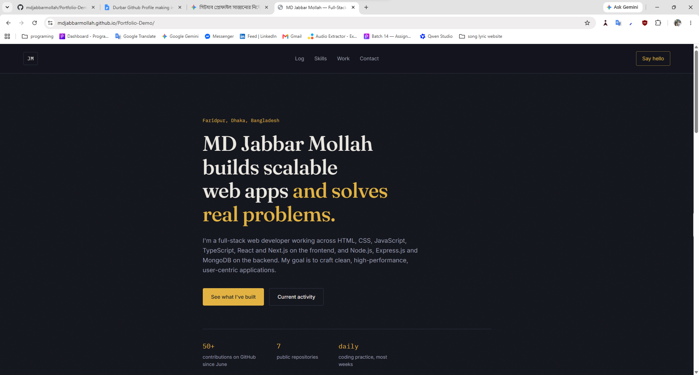

# Personal Portfolio — MD Jabbar Mollah

## Overview
A single-page personal portfolio for MD Jabbar Mollah, a full-stack web
developer based in Faridpur, Dhaka, Bangladesh. The page introduces who he is,
what he's currently working on, his tech stack across frontend and backend,
a couple of featured projects, and how to get in touch. Built as a clean,
framework-free foundation that's easy to extend as new projects are finished.

## Screenshot


> `screenshot.png` with your own image in this folder.

## Tech Stack
- HTML5 (semantic markup)
- CSS3 (custom properties, Grid, Flexbox, no framework)
- Vanilla JavaScript (`IntersectionObserver` for scroll-based nav state)
- Google Fonts: Fraunces, Inter, IBM Plex Mono

## Features
- Responsive layout, from mobile up to desktop
- Sticky top navigation with active-section highlighting on scroll
- "Current activity" section for what's being worked on right now
- Tech stack grouped by layer (languages / frontend / backend & tools)
- Project section with a repeatable two-column layout, ready for more entries
- Accessible focus states and `prefers-reduced-motion` support
- Zero dependencies, zero build step — works by opening `index.html`

## Dependencies
None. This is plain HTML/CSS/JS with fonts loaded from Google Fonts via
`<link>` tags — there is nothing to install.

## Local Setup
1. Clone or download this repository.
2. Open `index.html` directly in your browser, **or** serve it locally:
   ```bash
   npx serve .
   # or
   python3 -m http.server 5500
